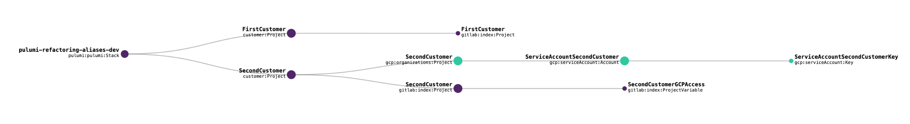

# Refactoring Pulumi code with `aliases`

 Ringo De Smet

**Guest Article:** [Ringo De Smet](https://www.linkedin.com/in/ringodesmet/), Founder of [Cumundi](https://www.cumundi.cloud), standardizes on Pulumi for writing infrastructure as code libraries to be delivered as reusable building blocks. Pulumi enables him to rapidly iterate through the build-test-release cycle of these building blocks.

Cumundi helps companies adopt cloud in a more integral way. Companies are developing the same 75% of underlying infrastructure. However, due to a shortage of people and time, there is a limited investment in integrating all the non-functionals of running applications in the cloud.

## How Pulumi code keeps up with changing requirements

At Cumundi we build reusable libraries for our customers to set up their infrastructure with a lot of best practices integrated. These best practices span the range of non-functionals, which are most of the time not taken up with the same focus as application feature development. Where these non-functionals can be integrated in infrastructure setups, we make sure these are taken care of in our code libraries. We focus on all three big cloud providers and try to provide application focused infrastructure libraries.

For our internal infrastructure it is no surprise that we also use Pulumi. At this early phase of our company (we founded January 1st!), it is hard to foresee how we will evolve. With Pulumi, we write code in a regular programming language. A good habit when programming is to prevent [premature optimization](http://wiki.c2.com/?PrematureOptimization) as you can't predict the future. Another good habbit when writing code is [red-green-refactor](https://en.wikipedia.org/wiki/Test-driven_development). You take the current code, write a test for the new requirement which is initially failing (red), you implement the code in the most straightforward way to make the test succeed (green) and you complete the cycle by refactoring the code to keep the design in a proper shape.

In this blog post, I will show such a cycle for Pulumi code with a reduced version of the code we use to set up the internal infrastructure we use ourselves for each customer. In this example, I will focus on one specific Pulumi resource property: [`aliases`](https://www.pulumi.com/docs/intro/concepts/programming-model/#aliases)

All the code is [published here](https://github.com/cumundi/pulumi-refactoring-aliases) if you want to follow along with a full project setup. Every step described here is committed as a separate branch with the starting point on `master`, the default branch.

### The starting point

Every Pulumi project starts empty, so ours is no exception. This is how our main Pulumi code file looks for now.

```ts
import * as pulumi from "@pulumi/pulumi";

const config = new pulumi.Config('gitlab')
```

Applying the above code does nothing and this is shown in the *Resources* tab on the hosted Pulumi platform:


### Adding the Git repository

We decided to create a separate repository for each of our customers:

```ts
const config = new pulumi.Config('gitlab')

const gitlabNamespace = config.getNumber('namespace')

const firstCustomer = new gitlab.Project("FirstCustomer",
    {
        name: "first-customer",
        description: "First Customer code",
        namespaceId: gitlabNamespace,
        visibilityLevel: "private",
        defaultBranch: "master",
        pipelinesEnabled: true,
        issuesEnabled: false,
        wikiEnabled: false,
        snippetsEnabled: false,
        containerRegistryEnabled: false,
        mergeRequestsEnabled: false,
        mergeMethod: "ff",
        onlyAllowMergeIfPipelineSucceeds: true,
        sharedRunnersEnabled: true
    }
)
```

We write it in the most straightforward way to get the job done. After `pulumi up`, the Gitlab project is created:


### A customer sometimes needs cloud infrastructure

For our second customer, I just duplicated the creation of the Gitlab repository, but I also had to add create a Google Cloud project and service account.

```ts
const secondCustomer = new gitlab.Project("SecondCustomer",
    {
        ... // properties here
    }
)

const secondCustomerProject = new gcp.organizations.Project("SecondCustomer",
    {
        projectId: 'second-customer',
        name: 'Second Customer Infrastructure'
    }
)

const serviceAccountSecondCustomer = new gcp.serviceAccount.Account("ServiceAccountSecondCustomer",
    {
        accountId: 'secondcustomer',
        displayName: 'Service Account for Second Customer project',
        project: secondCustomerProject.projectId
    }
);

const serviceAccountSecondCustomerKey = new gcp.serviceAccount.Key("ServiceAccountSecondCustomerKey",
    {
        serviceAccountId: serviceAccountSecondCustomer.email
    }
);

const secondCustomerGitlabCIVariable = new gitlab.ProjectVariable("SecondCustomerGCPAccess",
    {
        project: secondCustomer.id,
        variableType: 'file',
        key: "GOOGLE_APPLICATION_CREDENTIALS",
        value: serviceAccountSecondCustomerKey.privateKey.apply(value => Buffer.from(value, 'base64').toString('utf-8')),
        protected: true,
        environmentScope: "*"
    }
)
```

As you can see below, when adding these resources, they are all added with the `Stack` as their parent in the resource view. This is getting clumsy.


Visualisation goes a long way, but a flat list of resources does not provide you clarity on what belongs together. 

### Find relationships between resources

In the current state of the code, we created a Google Cloud service account and a key. Since a key can't be created without a service account, we also created a Gitlab CI project variable for the Gitlab project of the second customer. Two cases of a parent-child relationship.

While we have this relationship between our resources, we do not see this in the Pulumi state graph. How can we change this without affecting the real resources on Gitlab and Google Cloud?

We can pass [`CustomResourceOptions`](https://www.pulumi.com/docs/reference/pkg/nodejs/pulumi/pulumi/#CustomResourceOptions) as the last argument to every Pulumi resource we want to create. Of interest for this refactoring are `parent` and `aliases`.

To link the key to the service account, we set the `parent` property to the service account resource. If you would run `pulumi preview` now, you will notice that Pulumi wants to recreate the key. Pulumi wants to do this because it searches for the key being a child resource of the service account. In your last applied Pulumi state, that is not yet the case.

```ts
const serviceAccountSecondCustomerKey = new gcp.serviceAccount.Key("ServiceAccountSecondCustomerKey",
    {
        serviceAccountId: serviceAccountSecondCustomer.email
    },
    {
        parent: serviceAccountSecondCustomer
    }
);
```

How can we tell Pulumi that the existing key resource fullfils the expectation in our code? The `aliases` property to the rescue!

If you want to rename resources in a Pulumi state, or change the parent-child relationships, then the `aliases` property is your friend. Let us go ahead and indicate in our code that the existing key resource, which is linked to the `Stack`, is the key we are interested in.

```ts
const serviceAccountSecondCustomerKey = new gcp.serviceAccount.Key("ServiceAccountSecondCustomerKey",
    {
        serviceAccountId: serviceAccountSecondCustomer.email
    },
    {
        parent: serviceAccountSecondCustomer,
        aliases: [
            { parent: pulumi.rootStackResource }
        ]
    }
);
```

Before going forward, we also change the relationship between the Gitlab repository and the Gitlab CI variable. When you run `pulumi up`, this should not change anything on Gitlab and Google Cloud. But after applying these changes, refresh the resource view on the Pulumi platform to see the following state graph.


### Clean up duplication

In the previous step, I copied the code for the Gitlab repository from our first customer to our second customer. In this step, we will resolve this duplication issue. Along with it, we will make sure that customer projects can conditionally create the Google infrastructure needed.

I introduce a `ComponentResource` subclass which encapsulates all this, moving the code for the individual resources into the customer resource class. As we set up Google Cloud resources for some of our customers, we create a Google Cloud project and related resources only when required. We can use a regular Typescript `if` conditional for this.

```ts
import * as pulumi from "@pulumi/pulumi";
import * as gcp from "@pulumi/gcp";
import * as gitlab from "@pulumi/gitlab";
import * as util from 'util';

export interface ProjectArgs {
    // The name of the customer, e.g. "First Customer"
    customer: pulumi.Input<string>;
    // Indication whether we need to create Google Cloud infrastructure for this customer
    needsGoogleInfra: boolean;
    // Namespace in Gitlab to create the repositories in.
    gitlabNamespace?: pulumi.Input<number> | undefined
}

// Pulumi custom resource representing a customer project
export class Project extends pulumi.ComponentResource {
    constructor(name: string, args: ProjectArgs, opts: pulumi.CustomResourceOptions = {}) {
        super('customer:Project', name, {}, opts);

        var customerId = name.replace(/([a-zA-Z])(?=[A-Z])/g, '$1-').toLowerCase();
        var serviceId = name.replace(/([a-zA-Z])(?=[A-Z])/g, '$1').toLowerCase();

        const gitlabProject = new gitlab.Project(name,
            {
                name: customerId,
                description: pulumi.interpolate`${args.customer} code`,
                namespaceId: args.gitlabNamespace,
                visibilityLevel: "private",
                defaultBranch: "master",
                pipelinesEnabled: true,
                issuesEnabled: false,
                wikiEnabled: false,
                snippetsEnabled: false,
                containerRegistryEnabled: false,
                mergeRequestsEnabled: false,
                mergeMethod: "ff",
                onlyAllowMergeIfPipelineSucceeds: true,
                sharedRunnersEnabled: true
            }
        )

        if (args.needsGoogleInfra) {
            ... // Google Cloud and Gitlab CI Variable code here.
        }
    }
}
```

Now that I have our custom resource, I use it for our existing customers. Our main Pulumi file is now reduced to this:

```ts
const firstCustomer = new customer.Project("FirstCustomer",
    {
        customer: 'First Customer',
        needsGoogleInfra: false,
        gitlabNamespace: gitlabNamespace
    }
)

const secondCustomerProject = new customer.Project('SecondCustomer',
    {
        customer: 'Second Customer',
        needsGoogleInfra: true,
        gitlabNamespace: gitlabNamespace
    }
)
```

But if we apply this to our infrastructure, you will notice that the 2 custom resources are created and saved to your Pulumi state.


However, we have not updated the parent child relationships.

### Fix the remaining relationships

We have a representation of a customer project in our Pulumi state graph, but we want to see the resources of each customer as child resources of this abstraction, right?

The same trick with `parent` and `aliases` is used to *re-parent* our resources. Our resources are created within the constructor of our `Project` class. In Typescript, the language used in this example, we can use the keyword `this` to point to the `Project` instance.

```ts
export class Project extends pulumi.ComponentResource {
    constructor(name: string, args: ProjectArgs, opts: pulumi.CustomResourceOptions = {}) {
        super('customer:Project', name, {}, opts);

        var customerId = name.replace(/([a-zA-Z])(?=[A-Z])/g, '$1-').toLowerCase();
        var serviceId = name.replace(/([a-zA-Z])(?=[A-Z])/g, '$1').toLowerCase();
        
        const gitlabProject = new gitlab.Project(name,
            {
                name: customerId,
                description: pulumi.interpolate`${args.customer} code`,
                namespaceId: args.gitlabNamespace,
                visibilityLevel: "private",
                defaultBranch: "master",
                pipelinesEnabled: true,
                issuesEnabled: false,
                wikiEnabled: false,
                snippetsEnabled: false,
                containerRegistryEnabled: false,
                mergeRequestsEnabled: false,
                mergeMethod: "ff",
                onlyAllowMergeIfPipelineSucceeds: true,
                sharedRunnersEnabled: true
            },
            {
                parent: this,
                aliases: [
                    { parent: pulumi.rootStackResource }
                ]
            }
        )
```

While we are changing parent-child relationships, the service account resource is also updated to have the Google Cloud project as its parent. The end result should look like the state graph below.



If new people read this code, they might not immediately have a clear picture of how everything is wired up. However, looking at the Pulumi resource visualization, the following properties can immediately be deduced:

* our infrastructure has 2 customer projects
* one customer only has a Gitlab repository, while the other also has Google Cloud infrastructure
* if we create a Google Cloud project, we create a service account and a key together with it
* if we create a Google Cloud project, we also set a Gitlab CI variable. It's a pity though that I can't link the Gitlab CI variable to the key too.

### Next steps

You probably noticed by now that the `aliases` property accepts a list. You can provide entries like:

* `{ name: <some old name> }
* `{ parent: <some previous parent> }
* `{ name: <some old name>, parent: <some previous parent> }

Do notice that putting the first two in the `aliases` list is not the same as putting the third one in there as the single entry. I leave it up to the reader to test it and understand the difference.

If I allow myself one closing remark, it is this: values for `name` in the `aliases` property can not be `Input`s as they need to be resolvable at `preview` time, similar to the name of the resources themselves.

## Conclusion

The Pulumi programming model is well thought out with regards to evolution of an infrastructure. With `ComponentResource` and the `parent` and `aliases` properties, refactoring your infrastructure code is a breeze with respect to having these abstractions visualized on the Pulumi platform.
